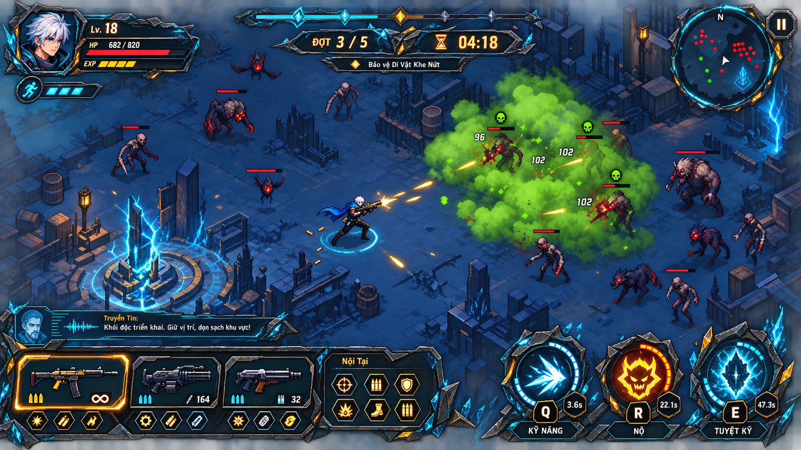

# Riftwarden: Echo Siege — bản 4.0

Trò chơi hành động sinh tồn 2D độc lập, chạy ngoại tuyến trên trình duyệt bằng **TypeScript, WebGL2, Canvas 2D, HTML và CSS**. Bản 4.0 định hình bản sắc **Di Vật Khe Nứt**, tổ chức lại bộ vũ khí thành một vũ khí chính và tối đa ba vũ khí phụ, chuẩn hóa đúng ba kỹ năng chủ động `Q`/`E`/`R`, đồng thời tiếp tục nâng cấp chuyển động, hiệu ứng pixel, âm thanh phản hồi và chiến dịch tiếng Việt gồm 20 nhiệm vụ.

**Bản vá 4.0.2:** chuyển bộ kỹ năng sang `Q` — kỹ năng lớp, `E` — Nộ, `R` — Tuyệt kỹ để giữ nguyên `WASD`; đồng bộ HUD, nút chạm, ARIA, tài liệu và kiểm thử chống xung đột với phím `W`.

**Bản vá 4.0.1:** sửa vũ khí bị chồng lên giữa thân Kael, thu nhỏ hình học vũ khí procedural, neo tay lệch khỏi silhouette ở đủ tám hướng và dời hiệu ứng chém Q ra phía đầu vũ khí.



> Hình trên là bản định hướng mỹ thuật. Khi kiểm thử thủ công trên máy đích, hãy lưu ảnh chạy thật đã xác nhận vào `docs/qa-latest/` theo checklist trong `docs/QA.md`.

## Chạy game

Gói phát hành có sẵn thư mục `dist/`; người chơi không cần cài phụ thuộc chỉ để mở game.

Máy cần có **Node.js 20 trở lên** để chạy máy chủ cục bộ đi kèm.

### Windows

Nhấp đúp:

```text
RUN_GAME.bat
```

Trình chạy sẽ mở địa chỉ:

```text
http://localhost:4173
```

### Dòng lệnh

```bash
node scripts/dev-server.mjs
```

Sau đó mở `http://localhost:4173`. Game phải được phục vụ qua HTTP vì trình duyệt chặn việc tải dữ liệu JSON từ `file://`.

### Phát triển và đóng gói

```bash
npm install
npm run typecheck
npm test
npm run build
npm run dev
```

`npm run dev` dựng game một lần rồi khởi động máy chủ cục bộ không cần phụ thuộc thời gian chạy.

## Điều khiển

| Hành động | Bàn phím / chuột | Tay cầm |
|---|---|---|
| Di chuyển | `WASD` hoặc phím mũi tên | Cần trái |
| Ngắm | Chuột; có thể bật tự ngắm | Cần phải |
| Lướt | `Space` | A / nút 0 |
| Kỹ năng chủ động | `Q` | X / nút 2 |
| Nộ riêng của nhân vật | `E` | B / nút 1 |
| Tuyệt kỹ riêng của nhân vật | `R` | Y / nút 3 |
| Xem toàn bộ chỉ số hiện tại | `Tab` | Nút Chỉ số trên HUD |
| Tạm dừng | `Esc` hoặc `P` | Start |

Hệ đầu vào cũng nhận nút ảo cho `Space`, `Q`, `E` và `R`; xem trạng thái hiển thị và thao tác cảm ứng trong [quy trình QA](docs/QA.md).

## Luồng một trận

1. Chọn nhân vật và bản đồ.
2. Nhận vũ khí chính theo nhân vật, sau đó chọn **1 trong 3** gói vũ khí phụ ngẫu nhiên. Đây chính là lựa chọn vũ khí ở **cấp 1**; mỗi gói kèm một buff nhỏ ngẫu nhiên và ba buff trong lượt không trùng nhau.
3. Ở cấp 5, 10, 15, 20… chọn vũ khí mới hoặc tăng cấp, tiến hóa và tinh thông cho vũ khí đang có. Ở các cấp còn lại chỉ nhận tăng cường đa dụng hoặc chỉ số người chơi.
4. Chiến đấu và hoàn thiện bộ trang bị gồm một vũ khí chính cùng tối đa ba vũ khí phụ tự động tấn công.
5. Hạ Elite/Boss và hoàn thành bản đồ.
6. Sau chiến thắng, nhận **10 điểm chỉ số vĩnh viễn** được phân phối ngẫu nhiên, rồi chọn thêm **1 trong 3** nâng cấp vĩnh viễn.

## Cốt truyện và Thư Khố

Chiến dịch 20 bản đồ được nối thành ba hồi: **Mỏ Neo Rạn Vỡ** (màn 1–7), **Bão Hư Không** (màn 8–14) và **Trái Tim Hỗn Mang** (màn 15–20). Mỗi bản đồ có phần tóm tắt, ba mục tiêu, lời truyền tin trước trận, một diễn biến giữa màn, lời báo giao tranh cuối và đoạn kết ngắn sau chiến thắng.

Tám nhân vật có động cơ, xung đột nội tâm, hành trình thay đổi, câu nhập trận và mạng quan hệ riêng. Thư Khố gồm các mục về thế giới, phe phái, nhân vật, địa danh, kẻ thù và di vật; mục đã mở có thể đọc lại theo tiến trình bản đồ/nhân vật.

Dữ liệu nằm trong `public/data/lore.json`. `NarrativeSystem` độc lập với giao diện và vòng lặp chiến đấu, phát mỗi mốc truyện đúng một lần; xem hợp đồng tích hợp trong phần kiến trúc bên dưới.

Mã trận có thể tái hiện bằng `?seed=1337`. Chế độ QA mở toàn bộ nội dung và rút ngắn thời lượng:

```text
http://localhost:4173/?qa=1&seed=1337
```

## Nâng cấp trọng tâm trong bản 4.0

### Bản sắc giao diện Di Vật Khe Nứt

- Các bảng chức năng mang hình khối phi đối xứng như mảnh di vật nứt vỡ, dùng nền đá đen–kim loại xám và đường năng lượng cyan. Màu hổ phách chỉ nhấn phần thưởng/cảnh báo; xanh độc chỉ dành cho cơ chế Độc.
- HUD gom thông tin theo đường quét mắt: chân dung, Sinh lực và EXP ở góc trên trái; mục tiêu ở giữa phía trên; tạm dừng ở góc trên phải; truyền tin ở góc dưới trái phía trên giá vũ khí; đúng ba ấn kỹ năng `Q`/`E`/`R` ở góc dưới phải.
- Lướt bằng `Space` là tài nguyên di chuyển riêng, không chiếm một ô kỹ năng thứ tư.
- Màn chọn vũ khí dùng ba phiến di vật và luôn cho thấy bộ hiện tại: một ô chính cùng ba ô phụ. Bố cục tham chiếu nằm tại `docs/concepts/weapon-choice-rift-relic-v4.png`.

### Nhân vật và hình ảnh

- Cả 8 Hộ Vệ đều có sprite sheet RGBA riêng, chuyển động **8 hướng × 4 khung**, bám chân dung thật và đã bake đúng vũ khí chính. Bộ dựng procedural chỉ còn là fallback khi asset lỗi.
- Di chuyển dùng tăng tốc, phanh và đảo hướng có kiểm soát; dash có đường cong vận tốc, động lượng thoát, dư ảnh và bụi chân. Camera nhìn trước theo vận tốc/hướng ngắm, có phản hồi va chạm nhưng vẫn tôn trọng mức rung do người chơi cài đặt.
- WebGL2 dựng nền, lưới, mốc định hướng và batch tối đa 48 vòng ground-VFX trong cùng một draw call; lớp gameplay trong suốt giữ nét pixel bằng cách tắt nội suy ảnh và chạy ở độ phân giải CSS để giảm tải raster CPU trên màn hình DPR cao. Đạn chính dùng atlas RGBA riêng; các VFX còn lại giữ hiệu ứng pixel động.
- Đạn hai phe khác nhau bằng cả hình và màu; Boss có thời gian báo chiêu; 8 Tuyệt kỹ có cách dàn cảnh riêng. Điện, Lửa, Băng, Độc, Choáng, Mù, Chảy máu và va chạm Vật lý khác nhau về hình, nhịp, màu và chữ sát thương; Chảy máu, Làm chậm, Choáng, Lửa, Điện và Độc còn có âm hiệu chuyên biệt.
- Mặt đất sử dụng lưới ít nhiễu; nhân vật, quái thường, Elite và Boss có màu/viền nhận diện khác nhau.
- Có tùy chọn tương phản cao, giảm hạt, tắt số sát thương và các chế độ hỗ trợ mù màu đỏ–lục/xanh–vàng.

### Cân bằng đầu trận

- Toàn bộ người chơi nhận thêm **12% sát thương** và **8% tốc đánh** khi khởi tạo trận.
- Sát thương cơ bản của địch còn **82%** và tốc độ di chuyển còn **90%** trước khi áp dụng hệ số bản đồ/làn sóng.
- Kẻ địch có Giáp theo kích cỡ/cấp bậc; xuyên giáp và chí mạng xử lý trực tiếp trên lượng Giáp hiệu lực.
- Lựa chọn vũ khí phụ ở cấp 1 làm bộ kỹ năng hoạt động sớm hơn; tăng cường đi kèm được giữ nhỏ để tránh phá đường cong sức mạnh.

### Vũ khí chính, vũ khí phụ và nhịp nâng cấp

- Mỗi Hộ Vệ luôn dùng **một vũ khí chính** để đánh thường và triển khai kỹ năng đặc hiệu `Q`.
- Người chơi có tối đa **ba vũ khí phụ**. Chúng tự động tấn công, lấy sát thương hiện tại của nhân vật làm nền nhưng giữ nhịp đánh, vùng tác động và hiệu ứng riêng.
- Bộ sinh lựa chọn tự cân bằng giữa vũ khí mới và tăng cường chuyên biệt. Khi đủ ba ô phụ, vũ khí mới bị loại hoàn toàn khỏi danh sách; các mốc vũ khí chỉ nâng cấp, tiến hóa hoặc tinh thông những món đã sở hữu.
- Lựa chọn khởi đầu được tính là mốc vũ khí **cấp 1**. Các cấp chia hết cho 5 chỉ đưa ra vũ khí/tăng cường vũ khí; mọi cấp khác chỉ đưa ra tăng cường đa dụng hoặc chỉ số áp dụng cho toàn bộ bộ trang bị.
- Khi một vũ khí đã đạt cấp/tiến hóa tối đa, lựa chọn tinh thông vẫn có thể tiếp tục cộng dồn để mốc vũ khí không bao giờ rỗng.

Các dấu ấn cơ bản giúp từng loại vũ khí có vai trò riêng: Lưỡi Đao Khe Nứt gây Chảy máu bằng 1,5% HP hiện tại mỗi giây trong 3 giây; Cung Vọng Âm làm chậm 20% trong 1 giây; đòn Huyền thuật có cấu hình Choáng 0,3 giây. Hiệu ứng cùng loại trên một mục tiêu làm mới thời gian hoặc giữ giá trị mạnh hơn thay vì nhân chồng vô hạn.

### Bom Khói Độc

- Hồi chiêu cơ bản **5 giây**; bom được ném gần người chơi theo hướng cụm kẻ địch đông nhất.
- Đám khói tồn tại từ **3–5 giây** theo cấp vũ khí.
- Mỗi giây, mục tiêu nhiễm độc nhận sát thương bằng **3% HP hiện tại + 90% sát thương hiện tại của nhân vật**.
- Độc làm chậm **20%**. Sau khi rời đám khói, trạng thái còn kéo dài **3 giây** rồi mới kết thúc.
- Hình ảnh dùng atlas pixel `toxic-smoke-vfx-v4.png`; pha ném, nảy, nổ, mây độc và nhịp sát thương có khung riêng để không lẫn với Lửa hay Mầm Độc Nở Hoa.

### Đạn và va chạm

- Đạn của người chơi gây sát thương cho **bất kỳ kẻ địch nào chạm vào đường bay**, không phụ thuộc mục tiêu đang khóa.
- Va chạm dùng phép quét đoạn di chuyển (*swept collision*), sắp xếp điểm chạm theo thời gian và vẫn kiểm tra đoạn cuối khi đạn hết tuổi/tầm bay. Điều này hạn chế đạn nhanh xuyên qua quái giữa hai khung hình.
- Xuyên mục tiêu, nổ diện rộng và vùng sát thương tồn tại lâu vẫn tuân theo cấu hình từng vũ khí.

### Buff cộng dồn trong trận

Những nhóm sau có thể tiếp tục tăng cấp/cộng dồn mà không bị khóa bởi cấp tối đa hiển thị: sát thương, số tia đạn, tốc đánh, hồi máu, hiệu lực hồi phục, HP tối đa, Giáp, xuyên giáp, tốc độ di chuyển, kháng hiệu ứng, tầm đánh, tốc độ đạn, hút máu, kích thước cơ thể và chặn sát thương.

Hút máu, xuyên giáp và kháng hiệu ứng dùng đường cong lợi ích giảm dần để giá trị vẫn cộng dồn nhưng không đạt trạng thái vô hạn tuyệt đối. Chí mạng thường không thuộc nhóm nâng cấp vĩnh viễn này.

### Hiệu ứng trạng thái

| Hiệu ứng | Cơ chế chính |
|---|---|
| Sét | Có thể lan mục tiêu, làm chậm và gây tê liệt ngắn; Boss/Elite có thời gian khống chế ngắn hơn quái thường. Choáng/tê liệt chặn cả va chạm cận chiến lẫn lượt tung chiêu của Boss. |
| Lửa | Thiêu đốt trong 4 giây, tính sát thương mỗi **0,25 giây**, gồm phần sát thương theo HP tối đa và phần sát thương nền; giảm **30%** hồi máu/hút máu của mục tiêu khi hiệu lực còn tồn tại. |
| Mù | Kéo dài từ **0,8–3 giây** theo tỉ lệ gây trạng thái; mỗi mục tiêu chỉ có thể bị tái mù sau **8 giây**. Trong thời gian mù, sát thương tiếp xúc, phát nổ, đạn tầm xa, loạt đạn Elite và đòn đạn/telegraph của Boss đều không thể gây hại cho người chơi. |
| Khổng lồ | Tăng kích thước theo phần trăm, đồng thời tăng HP tối đa và tầm đánh; `chặn sát thương` trừ một lượng phẳng trước khi Giáp rồi HP xử lý phần còn lại. |

### Chí mạng

| Loại | Tỉ lệ | Sát thương | Bỏ qua Giáp | Cách nhận |
|---|---:|---:|---:|---|
| Chí mạng thường | 10% mặc định | 180% | 40% | Chỉ thay đổi tạm thời trong trận qua mảnh hoặc nâng cấp trong trận; không có nâng cấp vĩnh viễn. |
| Chí mạng kỹ năng | 10% sau khi có mảnh | 200% | 50% | Mảnh siêu hiếm; mỗi mảnh bổ sung tăng thêm 50 điểm phần trăm sát thương chí mạng kỹ năng: 250%, 300%, ... |

Mảnh chí mạng kỹ năng có tỉ lệ cơ bản **0,012%** trên quái cỡ vừa/lớn và Boss. May mắn làm tăng cơ hội rơi nhưng không biến nó thành nâng cấp vĩnh viễn.

### May mắn và mảnh chỉ số

- May mắn tăng cơ hội rơi vàng, vật phẩm hồi phục và mảnh chỉ số.
- Mảnh chỉ số áp dụng một lượng nhỏ chỉ số **tạm thời trong trận**: sát thương, tốc đánh, tốc độ di chuyển, Giáp, HP, hút máu, hồi HP, May mắn, số tia, xuyên giáp, kháng hiệu ứng, kích thước, chí mạng; đôi khi mảnh hồi máu ngay.
- Mảnh chí mạng kỹ năng được theo dõi riêng với mảnh chỉ số thường.

### Bộ ba kỹ năng `Q`/`E`/`R`

- `Q` là kỹ năng đặc hiệu của lớp nhân vật, luôn lấy vũ khí chính làm nguồn ra chiêu.
- `E` là Nộ: kéo dài **5 giây**, tăng tốc đánh lên **3 lần** nhưng sát thương còn **90%**. Mỗi nhân vật nhận thêm một đặc tính: thêm tia/linh thể hoặc miễn hiệu ứng bất lợi.
- `R` là Tuyệt kỹ diện rộng: ngoài vùng sát thương/khống chế riêng, trong **5 giây** nhân vật được cộng **10% sát thương cơ bản** và mỗi giây hồi **10% lượng Sinh lực đang thiếu**.
- Chí mạng kỹ năng chỉ được mở sau khi nhặt mảnh chí mạng kỹ năng. Lướt `Space` vẫn hoạt động độc lập với ba kỹ năng trên.

| Nhân vật | `Q` — kỹ năng đặc hiệu | Thưởng thêm khi Nộ `E` | Bản sắc Tuyệt kỹ `R` |
|---|---|---|---|
| Kael Orin | **Ấn Kiếm Hồi Sinh** quét Lưỡi Đao và hút lại một phần sát thương. | Miễn hiệu ứng bất lợi. | **Bão Khe Nứt** tạo bão kiếm diện rộng. |
| Mira Voss | **Loạn Tiễn Cuồng Phong** bắn chín mũi tên hình quạt. | Mỗi loạt bắn thêm một tia. | **Mưa Tên Thiên Không** trút mưa tên xuyên thấu. |
| Toren Vale | **Thánh Thuẫn Bất Hoại** lập tức phát xung làm choáng và cho miễn sát thương ngắn. | Miễn hiệu ứng bất lợi. | **Địa Chấn Lò Rèn** tạo chấn động Lửa diện rộng. |
| Nyra Sol | **Băng Hoại Tứ Nguyên** nối sóng Lửa với Băng Hoại để làm chậm/tê cứng. | Mỗi phép bắn thêm một tia. | **Bão Tố Nguyên Tố** luân chuyển Lửa, Băng, Sét và Độc. |
| Zarek Venn | **Trích Huyết Độc** đầu độc, giảm hồi máu và hút lại Sinh lực. | Miễn hiệu ứng bất lợi. | **Đêm Dịch Bệnh** phủ dịch độc và giảm hồi máu diện rộng. |
| Elara Quill | **Bầy Vọng Âm** gọi sáu linh thể tự tìm mục tiêu. | Mỗi đợt gọi thêm một linh thể. | **Quân Đoàn Vọng Âm** triệu hồi lực lượng tấn công mọi hướng. |
| Titan Rho | **Trọng Chấn Phá Thành** kích nổ trọng lực, hất văng và làm choáng. | Miễn hiệu ứng bất lợi. | **Titan Giáng Thế** nện vùng rộng bằng va chạm khổng lồ. |
| Nova Lys | **Nếp Gấp Hư Không** kéo mục tiêu về tâm và gây Mù. | Mỗi tân tinh thêm một tia. | **Sụp Đổ Hư Không** tạo vùng co sập diện rộng. |

## Bản đồ gần như không giới hạn

Đấu trường không có tường biên cố định. Nền được dựng theo tọa độ thế giới và tiếp tục xuất hiện khi người chơi di chuyển. Khi tọa độ vượt ngưỡng an toàn, hệ **floating origin** dịch toàn bộ thực thể/camera về gần gốc, tránh mất độ chính xác số thực trong một phiên dài.

Vật phẩm quá xa và tồn tại lâu được tự thu gom hoặc giải phóng tùy loại; địch ngoài vùng chiến đấu cũng được thu hồi vào pool. Vì vậy “gần như không giới hạn” mô tả không gian khám phá, không có nghĩa là giữ vô hạn thực thể trong bộ nhớ.

Quái mới chỉ xuất hiện trong một vành elip bám theo người chơi, tương đương khoảng **1/3–1/2 chiều rộng và chiều cao khung nhìn**. Vành này tránh sinh quái sát người chơi nhưng cũng không đặt chúng quá xa ngoài màn hình; kích thước được tính lại theo viewport desktop/mobile.

## Tiến trình vĩnh viễn sau bản đồ

Chiến thắng tạo hai lớp thưởng:

- **10 điểm** được phân phối ngẫu nhiên vào tốc đánh, tốc độ di chuyển, Giáp, sát thương, hút máu hoặc May mắn.
- **1 lựa chọn trong 3** nâng cấp vĩnh viễn; lựa chọn được lưu ở trạng thái chờ để không mất nếu đóng trang trước khi nhận.

Dữ liệu lưu dùng khóa LocalStorage:

```text
riftwarden-echo-siege-save
```

Phiên bản lược đồ hiện tại: **4**. `SaveSystem.ts` gộp dữ liệu cũ với giá trị mặc định an toàn khi di trú và tách rõ màn cao nhất đã mở khỏi màn cao nhất đã hoàn thành để Thư Khố không mở sớm.

## Nội dung đi kèm

- 8 nhân vật chơi được, mỗi nhân vật có chỉ số, vũ khí khởi đầu, nội tại, Nộ và Tuyệt kỹ riêng.
- 14 vũ khí, gồm một vũ khí chính theo nhân vật và tối đa ba vũ khí phụ; mỗi vũ khí có dữ liệu cấp 1–8 và đường tăng cường chuyên biệt.
- Các hành vi: chém cận chiến, cung, súng tự động, phi tiêu xuyên, bom, sét chuỗi, cầu lửa, mảnh băng, laser, vùng độc, quỹ đạo phòng thủ, triệu hồi, nova huyền thuật và Bom Khói Độc tìm cụm mục tiêu.
- 20 bản đồ dữ liệu, đội hình địch và ngân sách làn sóng riêng.
- Hơn 20 cấu hình địch, gồm nhiều AI, Elite và 4 Boss nhiều giai đoạn.
- Reroll, bỏ qua và loại bỏ lựa chọn khi lên cấp.
- Cửa hàng nâng cấp meta, mở khóa nhân vật/bản đồ và dữ liệu lưu có phiên bản.

## Hỗ trợ tiếng Việt

Toàn bộ nội dung hướng tới người chơi trong bản 4.0 dùng tiếng Việt: menu, HUD, bảng nhiệm vụ, mục tiêu, truyền tin, Thư Khố, lựa chọn đầu trận, nâng cấp, cảnh báo, kết quả, cài đặt, dữ liệu lối chơi và nhãn trợ năng. Tên riêng như Kael Orin được giữ nguyên. ID kỹ thuật, tên tệp và API trong mã nguồn vẫn dùng tiếng Anh để tránh phá tương thích; chúng không phải nội dung hiển thị cho người chơi.

## Kiến trúc

```text
src/
├─ core/          # nhập liệu, âm thanh, lưu, RNG, pool, spatial hash, kiểu dữ liệu
├─ data/          # tải và kiểm tra public/data/*.json
├─ game/          # nhân vật, vũ khí, đạn, AI, loot, kỹ năng, tiến trình
├─ narrative/     # kiểu dữ liệu cốt truyện, nhiệm vụ, quan hệ và Thư Khố
├─ render/        # camera và Canvas renderer
├─ ui/            # giao diện, HUD và các màn hình lựa chọn
├─ main.ts
└─ styles.css

public/data/
├─ characters.json
├─ lore.json
├─ weapons.json
├─ passives.json
├─ evolutions.json
├─ enemies.json
├─ stages.json
├─ upgrades.json
└─ meta-upgrades.json
```

### Hợp đồng tích hợp cốt truyện

- Khởi tạo `new NarrativeSystem(data.lore)` một lần.
- Khi chọn nhiệm vụ, gọi `startStage(stage.id, character.id)` để lấy `MissionBriefing`: hồi truyện, 3 mục tiêu, `transmission` và câu nhập trận.
- Trong trận, gọi `updateProgress(stageManager.progress())`; hiển thị các lời truyền tin trả về theo thứ tự.
- Khi `StageManager` yêu cầu sinh Elite/Boss, gọi `triggerFinalEncounter()` trước lúc sinh đối tượng.
- Khi thắng, gọi `completeStage()` để lấy lời kết màn, mã mục Thư Khố vừa mở và đoạn kết/hậu truyện nếu là màn 20.
- Màn Nhật Ký dùng `listCodex({ highestCompletedStage, unlockedCharacterIds })`; chỉ cho mở nội dung có `unlocked: true`. `relationshipsFor(characterId)` cấp dữ liệu cho hồ sơ quan hệ.

`DataStore` kiểm tra phạm vi 3 hồi, thứ tự đủ 20 màn, loại giao tranh cuối, 8 hồ sơ nhân vật, quan hệ hai chiều, tham chiếu Thư Khố và hậu truyện trước khi cho game khởi động.

## Thiết kế hiệu năng

- Pool cho địch, đạn, hạt, vật phẩm, telegraph và chữ sát thương; lấy phần tử trống theo O(1).
- Spatial hash tái nhập an toàn cho các truy vấn va chạm lồng nhau.
- Director sinh quái theo ngân sách thời gian và chi phí từng loại.
- Gộp EXP, dọn loot xa/lâu, giới hạn hạt theo ngân sách và thu hồi địch ngoài vùng hoạt động.
- Số đạn hiển thị được bảo vệ bằng ngân sách; phần vượt ngưỡng được gộp vào sát thương thay vì tạo vô hạn thực thể.
- Delta mỗi khung hình được giới hạn; quy mô quái và tốc độ sinh có trần bảo vệ.

Hệ số độ khó chính nằm trong `src/game/Scaling.ts`:

```text
health = 1 + 0.16(stage-1) + 0.006(stage-1)^2 + 0.11(wave-1)
damage = 1 + 0.09(stage-1) + 0.055(wave-1)
speed tối đa 1.38×
spawn rate tối đa 2.90×
elite rate tối đa 18%
```

## Kiểm thử

Quy trình, tiêu chí phát hành và vị trí ảnh chụp nằm trong [docs/QA.md](docs/QA.md). Tài liệu không mặc định coi một gói là đạt; kết quả chỉ được ghi sau khi chạy lại kiểm tra trên đúng bản dựng phát hành.

## Mỹ thuật và âm thanh

- Tám sprite sheet Hộ Vệ 8 hướng, 14 icon vũ khí V2, atlas đạn đạo V2, atlas hiệu ứng pixel, atlas va chạm/trạng thái và atlas Bom Khói Độc được tạo riêng cho dự án.
- Ảnh chân dung, biểu tượng vũ khí, quái, Boss, thumbnail bản đồ và key art là tài sản gốc hoặc biến thể được tạo cho dự án.
- Âm thanh thời gian chạy được tổng hợp bằng Web Audio và có thể được thay bằng `.wav`/`.mp3` mà không đổi hệ gameplay.
- Xem danh mục đầy đủ tại [ASSET_MANIFEST.md](ASSET_MANIFEST.md).

## Phạm vi hiện tại

- Đây là bản web hoàn chỉnh theo luồng dọc, chưa phải gói cài đặt Steam/Android/iOS.
- Cả tám Hộ Vệ dùng sprite sheet gameplay riêng khớp chân dung và vũ khí. Renderer procedural chỉ được gọi làm fallback khi sprite tương ứng không tải được.
- Âm thanh là procedural, chưa phải nhạc nền được hòa âm/master chuyên nghiệp.
- Cốt truyện dùng bảng nhiệm vụ và truyền tin ngắn trong trận; chưa dùng phim cắt cảnh dựng sẵn để giữ nhịp chơi nhanh và dung lượng nhẹ.
