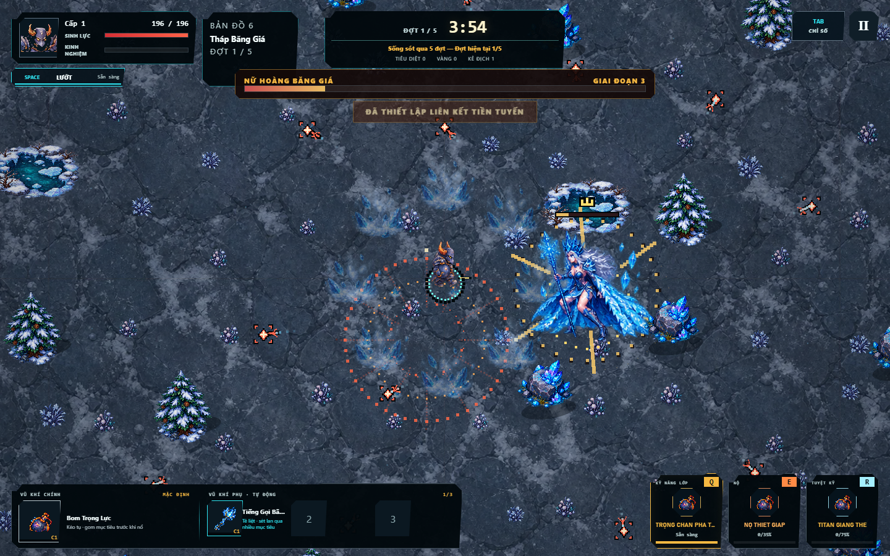
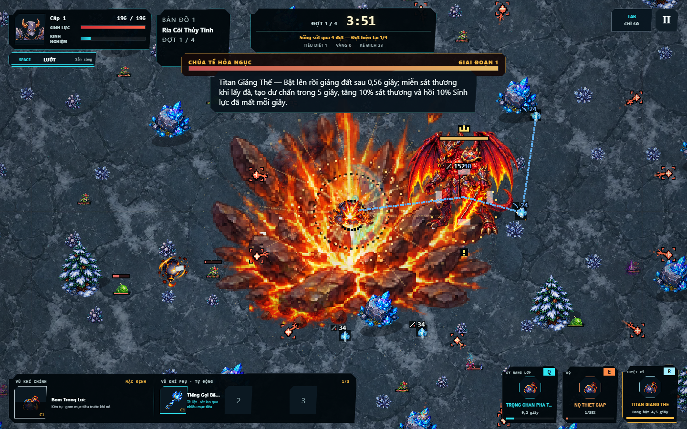

# Phát hành 4.1.0 — Địa Chấn Thức Tỉnh

Ngày kiểm tra: 2026-09-05. [Chơi game](https://daiduong2512.github.io/game2/) · [Gói dist](https://github.com/DaiDuong2512/game2/releases/tag/v4.1.0).

## Hình ảnh và chuyển động

- Nền bốn biome bám tọa độ thế giới, không nhảy khi đặt lại gốc tọa độ; cây/cỏ có gió, nước có gợn và môi trường có hạt chuyển động.
- Cây, đá, quái và nhân vật xếp theo chiều sâu; vật cản che người chơi được làm mờ. Ánh báo chiêu vẫn nhìn thấy trên nền mới ở cả WebGL2 và Canvas 2D.
- Bốn boss dùng 24 tư thế riêng: nghỉ, bước, lấy đà, tấn công và hồi thế. 24 khung hiệu ứng riêng cho hư không, chấn động, băng và lửa; Infernus có thiên thạch rơi, Frost Queen có vòng băng giữ tâm an toàn.
- Titan có hai chuỗi Q/R gồm 12 tư thế và 6 khung va chạm. Q gây sát thương sau 0,32 giây, R đáp xuống sau 0,56 giây; không thể hủy tư thế đang nện bằng lướt hoặc kỹ năng khác. Nộ vẫn áp dụng buff và giữ tư thế đang thực hiện.
- HUD điện thoại sửa phần sinh lực và góc cắt nhãn kỹ năng/vũ khí.

## Logic và cân bằng

- Kiểm tra khoảng cách tròn chính xác cho chiêu diện rộng, hút và hồi máu; sửa kẹt ở đúng tâm vật cản và đạn nổ biến mất khi va vào địa hình.
- Mầm Độc đặt vùng đầu tại mục tiêu thay vì lệch ra ngoài bán kính sát thương. Tân Tinh bám mục tiêu; đạn homing quay được khi mục tiêu nằm sau lưng.
- Titan Q: 70 → 78 sát thương cơ sở, bỏ lực đẩy cộng chồng. R: đòn đáp 92 → 140, dư chấn 18 → 24. Khoảng lấy đà tạo cơ hội phản ứng và đồng bộ hit với hình ảnh.
- Hệ số sát thương Băng 1,18 → 1,35; laser 1,12 → 2,10; quỹ đạo 1,16 → 1,08; triệu hồi 1,15 → 1,03. Mira giữ +0,5%/mạng trong 100 mạng đầu, sau đó giảm dần lợi ích và tiến tới giới hạn +100%.
- Boss báo chiêu 0,65 → 0,85 giây, có 0,52 giây hồi thế, giảm nhịp tung chiêu ở pha cao. Sát thương thiên thạch Infernus 1,40 → 1,25 lần, rơi lệch nhịp; hủy nguy hiểm chờ khi boss chết.

## Kết quả kiểm tra

- npm run check: typecheck đạt, **252/252 test đạt**; gồm hồi quy Q/E/R, thời điểm và khóa tư thế Titan, hình học vùng trúng, homing, Mira, terrain rebase và alpha atlas.
- Chrome tự động: **8 nhân vật × Q/E/R**, **20 map**, **4 boss × 3 pha**, đầy đủ 6 khung boss, không lỗi JavaScript hoặc HTTP 4xx/5xx trong lượt kiểm tra. [Báo cáo](qa-latest/browser-release-v8.json).
- Vòng lặp trận chạy thật: nhấn di chuyển + Q/R Titan, boss trồi từ alpha 0 tới 1 rồi di chuyển; hai lần dùng chiêu được ghi nhận. [Báo cáo](qa-latest/gameplay-live-v8.json).
- Mobile giả lập 390 × 844, DPR 2: không tràn ngang. Canvas 2D dự phòng khởi động và vẽ được.
- Stress render 300 quái hiển thị + 400 đạn: lượt cuối trung bình gửi lệnh vẽ/HUD **16,41 ms**, p95 **25,40 ms** trên Chrome headless trong môi trường này (lượt trước 9,16/15,00 ms; kết quả chịu ảnh hưởng tải máy). Đây không phải FPS toàn vòng lặp, không đại diện tốc độ trên điện thoại thật.
- Kiểm tra manifest: 102 mục, 88 ảnh; mọi tham chiếu và SHA-256 hợp lệ. Dist khoảng **18,68 MiB**, giảm khoảng **59,7%** so với build module 48.594.482 byte.

## Số đo cân bằng có thể lặp lại

Chạy npm run build rồi npm run balance:audit. Đo 60 giây ở 120 Hz, sát thương/tốc đánh chuẩn hóa, mục tiêu đứng cách 100 đơn vị, bán kính 18; một mục tiêu và vòng 12 mục tiêu, vũ khí cấp 1/8. Không tính giáp, chí mạng, DoT, nội tại hay địa hình. Đây là phép phát hiện sai lệch cơ học, không phải xếp hạng sức mạnh tổng thể. Bom Khói Độc có DPS trực tiếp bằng 0 trong mô hình này vì dùng DoT.

| Vũ khí, cấp 1 / một mục tiêu | Trước | Sau |
|---|---:|---:|
| Laser | 11,76 | 22,05 |
| Mầm Độc | 0 | 26,20 |
| Tân Tinh | 3,85 | 9,36 |
| Băng | 10,62 | 12,15 |
| Triệu hồi | 55,20 | 49,44 |
| Quỹ đạo | 26,98 | 25,12 |

[Báo cáo trước](qa-latest/balance-before-v8.json) · [Báo cáo sau](qa-latest/balance-after-v8.json). Chưa có khảo sát chơi dài hạn với người chơi hoặc kiểm tra trên điện thoại vật lý.

## Dựng và đồng bộ GitHub Pages

1. npm ci
2. npm run check
3. npm run build:release
4. node scripts/verify-release.mjs dist
5. node scripts/sync-pages.mjs
6. Commit và push nhánh main; Pages phục vụ thư mục gốc.

Không chạy build thường sau bước 3 trước khi đồng bộ: build thường dành cho kiểm thử module, không phải bản nén. Nguồn HTML là src/index.html. Thư mục public/ giữ PNG nguồn; assets/ tại gốc giữ WebP phát hành. Công cụ đồng bộ chỉ thay đầu ra phát hành và xóa JS/map cũ nằm cạnh TypeScript trong src/.

RELEASE_MANIFEST.sha256 thay manifest toàn dự án cũ; chỉ kiểm tra các tệp chạy thật. .gitattributes giữ nguyên byte các tệp này khi Git checkout để hash không đổi. Zip dist chứa nội dung web tĩnh, cần được phục vụ qua HTTP; không mở trực tiếp bằng file://.

ZIP phát hành: 19.199.995 byte; SHA-256: `9f37acb82ff4ce1462f3056c45e3d241601f9b8ae6fbf65dd095e2992c690ff2`. Đã đối chiếu đủ 102 hash trong ZIP, tổng 103 tệp gồm manifest và .nojekyll. FILE_MANIFEST.sha256 cũ vẫn được giữ làm lịch sử, không dùng cho phiên bản này.

## Ảnh kiểm tra và nguồn tài sản

[Tệp nguồn và bộ prompt](ASSET_PROMPTS_4_1.md). Các ảnh này là ảnh chụp game, không phải concept.
